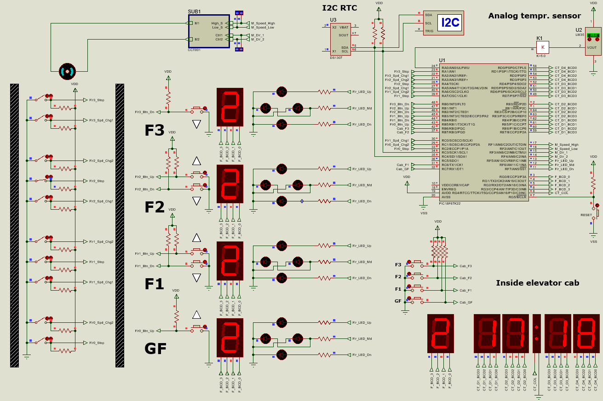

# Elevator Controller Firmware

_Authors: Antoine Karam and Ghady Youssef_

_Submitted in partial fulfillment of the Firmware Design course_

This project designs a 4-floor elevator controller written in C.

## Assignment requirements

**Floor information**

On each floor there are:

- One 7-segment-digit display for floor number indication.
- One UP button (except on F3).
- One DOWN button (except on GF).
- UP/DOWN LED arrow indication.
- Three limit switches for cabin feedback:
  - One indicates the STOP position.
  - One indicates SPEED CHANGE when going UP (except of F3).
  - One indicates SPEED CHANGE when going DOWN (except on GF).

**Cabin information**

Cabin interior:

- Four buttons each for a floor.
- One 7-segment-digit display for floor number indication.
- Four 7-segment-digit display intended to show time (HH:MM), date (DD MM) and temperature (TT dC) in sequence, 10 seconds apart.
  - Two options for the calendar implementation aka Real-Time Clock (RTC):
    - Either you implement it by software, or
    - Use an I2C-based external RTC (datasheet included).
      - **A bonus will be added when using external RTC.**
- The temperature is delivered by the famous LM35 analog sensor.
- Two-level speed control.
- Dual direction control.

## Getting Started

### Prerequisites

Ensure you have the following components:

1. **Proteus** to run the simulation.
2. **CCS C Compiler** to build the firmware.
3. **VS Code** if you want to make any changes to the code (optional but recommended over the CCS C Compiler editor).
4. Install `clang-format` and `cppcheck` to ensure the CI pipeline passes.

## Project Structure

The `firmware/src` directory contains the source code which will run on the microcontroller.
It contains the scheduler in `sched`, `drivers` for the LM35 and DS1307, and the `api` which contains exposed functions to manipulate floor sensors, control the motor, and manage the scheduler.

## Screenshots

